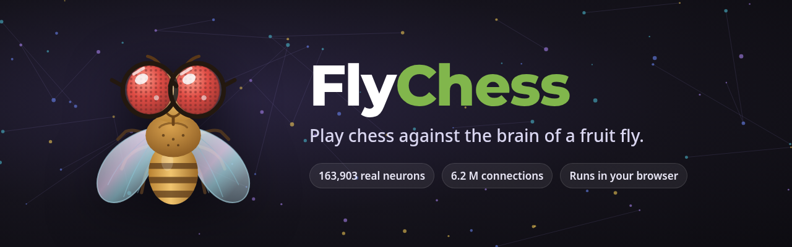

Your opponent is the real wiring diagram of a *Drosophila* nervous system:
163,903 neurons and 6.2 million connections, mapped neuron by neuron under an
electron microscope. We kept that wiring exactly as nature built it, taught
only the strength of its synapses to play chess, and put it in your browser.

While you play, you can watch the fly think: every move sends a wave of
activity from its eyes through its brain, and you see it happen.


## Try it

```bash
pnpm install
pnpm dev        # → http://localhost:5180
```

Nothing runs on a server. The brain (about 31 MB) downloads once and then
thinks on your GPU (WebGPU), or on the CPU if no GPU is available.

## What you get

- **Three flies to play**, all the same brain:
  - **Reflex** (~1100): moves on pure instinct.
  - **Planner** (~1310): imagines your replies first.
  - **Thinker** (~1340): keeps thinking deeper while it has time.
- **The fly's brain, live**: a 3D cloud of its real neurons lighting up
  step by step, the signal flowing between brain regions, the moves it
  is weighing, and what the board looks like through its eyes.

  

- **Game review**: after the game, Stockfish rates every move and gives
  both players an accuracy score. You can replay the game with the fly's
  brain activity and its thoughts at every move.

  

- **A proper chess site feel**: drag or click to move, premoves, arrows,
  clocks, move history, takebacks, a hint from the fly, a Stockfish
  evaluation bar you can turn off, and PGN export. The site is in English
  and Polish.

## How good is it?

It plays like a club beginner. Against Stockfish capped at 1320 Elo, the
Thinker won about half its games. That's a fair result for something
with a brain smaller than a poppy seed that had to learn from scratch
what a legal move is.

## Want the details?

- [How the fly plays](docs/how-it-works.md): the neuron model, how it sees
  the board, and how it decides.
- [How it was trained](docs/training.md): the data, the losses, versions
  v1–v6, measurements and limitations.
- [Development](docs/development.md): project layout, tests, and swapping
  in a new model.
- [Data and licences](docs/data.md)
- [Trained brains](artifacts/): the exported fly-v6 and fly-v4 models, with notes.

Code: [MIT](LICENSE). Connectome: MaleCNS v1.0, CC BY 4.0. The evaluation bar
uses Stockfish (GPL-3.0).
